<p align="center">
    <picture>
        <source media="(prefers-color-scheme: dark)" srcset="art/banner-dark.svg">
        <source media="(prefers-color-scheme: light)" srcset="art/banner-light.svg">
        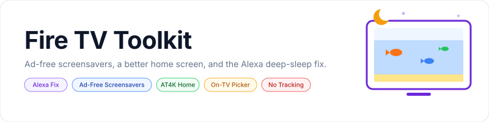
    </picture>
</p>

<p align="center">Ad-free screensavers, a better home screen, and the Alexa deep-sleep fix for your Fire TV, set up from your terminal.</p>

<p align="center">
    <a href="https://github.com/jeremykenedy/fire-tv-toolkit/releases/latest"></a>
    <a href="https://github.com/jeremykenedy/fire-tv-toolkit/actions/workflows/tests.yml"></a>
    <a href="https://github.com/jeremykenedy/fire-tv-toolkit/actions/workflows/gitguardian.yml"></a>
    <a href="https://sonarcloud.io/summary/new_code?id=jeremykenedy_amazon-fire-tv-fixes"></a>
    <a href="https://sonarcloud.io/summary/new_code?id=jeremykenedy_amazon-fire-tv-fixes"></a>
    <a href="https://app.codacy.com/gh/jeremykenedy/fire-tv-toolkit/dashboard"></a>
    <a href="LICENSE"></a>
</p>

<p align="center">
    <a href="https://app.aikido.dev/repositories/3225041"></a>
</p>

<p align="center">
    <a href="https://github.com/jeremykenedy"></a>
    <a href="https://github.com/jeremykenedy/fire-tv-toolkit"></a>
    <a href="https://github.com/jeremykenedy/fire-tv-toolkit/stargazers"></a>
    <a href="https://github.com/sponsors/jeremykenedy"></a>
</p>

## Table of Contents

- [What it does](#what-it-does)
- [Features](#features)
- [Screenshots](#screenshots)
- [Platform support](#platform-support)
- [Requirements](#requirements)
- [Integrations](#integrations)
- [Putting your Fire TV in developer mode](#putting-your-fire-tv-in-developer-mode)
- [Installation](#installation)
- [Commands](#commands)
- [Upgrading](#upgrading)
- [Configuration](#configuration)
- [File tree](#file-tree)
- [Documentation](#documentation)
- [Testing](#testing)
- [Changelog](#changelog)
- [Credits](#credits)
- [License](#license)

## What it does

Fire TV Toolkit is a command-line tool that takes your Fire TV back from the
ads and the bugs. It talks to the TV over adb from your computer, and every
change is explained before it happens, confirmed by you, and reversible.

Run `start` and it walks you through it: connect to the TV, turn on the Alexa
deep-sleep fix, install ad-free screensavers, pick the one you want, and
optionally swap the home screen for AT4K. Every step is also its own command,
so you can run just the part you need later.

## Features

- **Alexa deep-sleep fix**: keeps Alexa able to reach the TV while it sleeps. Fire OS has a setting for this that its own toggle never writes.
- **Ad-free screensavers**: replaces Amazon's ad-serving screensaver with Aerial Views (the default), AndroSaver, Snoozy, Aquarium Live, Aquarium 4K, Jellyfish Drift, Firefly Grove, Neon Corridor, Starfield Drift, Rain on Glass, Rainforest Cascade or Blue Meridian, each an optional install. Android's built-in Colors, and Amazon with Ads, stay available to switch back to.
- **Verified downloads**: every APK comes from a GitHub release and is checked against a published SHA-256 before it is installed.
- **Optional AT4K home screen**: an ad-free home screen in place of the Amazon menu, switched on or off with one command.
- **On-TV screensaver picker**: a Screensavers tile on the TV for switching the screensaver from the couch, since Fire OS Settings only offers Amazon's.
- **Optimize for screensavers**: checks the TV for settings that stop or spoil a screensaver (screensaver switched off, sleep coming before the screensaver, Amazon's Ambient Experience, Aerial Views' frame rate permission) and fixes only the ones it has. Offered during `start` and `update`, or run `optimize` any time.
- **Guard against Amazon**: Home Redirect saves the screensaver, Alexa fix, Home and timeout settings and puts them back the moment Amazon changes them, after a reboot, after an app update, and every 15 minutes. Amazon's updaters are held back as far as Fire OS allows. `guard --check` reports and fixes anything that slipped through.
- **Timeout control**: view, change and reset the sleep and screensaver timeouts, with the first value seen on your TV saved as its baseline.
- **Full revert**: put the TV back how it was, item by item, then remove the tool from your computer.
- **Script friendly**: every command takes flags, answers `--help`, and exits non-zero on failure.
- **Safe by default**: nothing changes until you confirm, Esc cancels any prompt, and risky steps need a typed confirmation.

## Screenshots

Captured on an Insignia Fire TV Edition TV and in macOS Terminal. Jellyfish Drift, Firefly Grove, Neon Corridor, Starfield Drift, Rain on Glass, Rainforest Cascade and Blue Meridian use the screenshots from their own repositories. Select any screenshot to see it full size.

### The home screen and the on-TV picker

<p align="center">
    <a href="docs/screenshots/tv-at4k-home.jpg"><picture><source media="(min-width: 1280px)" srcset="docs/screenshots/grid/tv-at4k-home-desktop.jpg 2x"><source media="(min-width: 600px)" srcset="docs/screenshots/grid/tv-at4k-home-tablet.jpg 2x">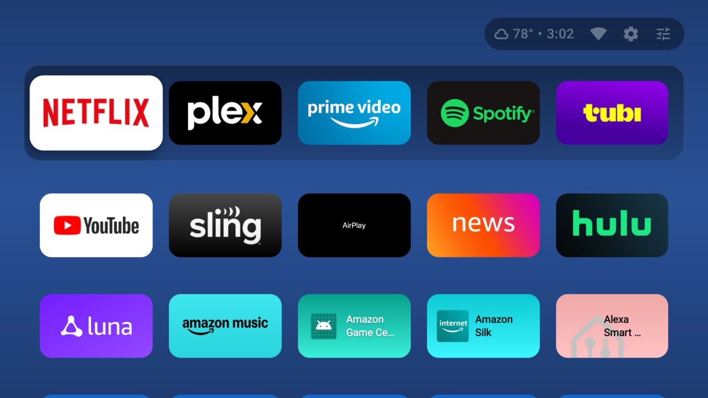</picture></a>
    <a href="docs/screenshots/tv-at4k-screensavers-tile.jpg"><picture><source media="(min-width: 1280px)" srcset="docs/screenshots/grid/tv-at4k-screensavers-tile-desktop.jpg 2x"><source media="(min-width: 600px)" srcset="docs/screenshots/grid/tv-at4k-screensavers-tile-tablet.jpg 2x">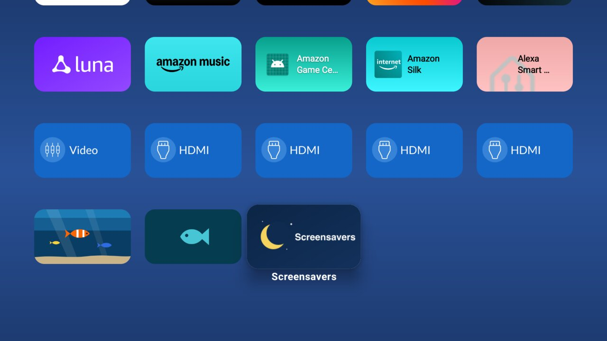</picture></a>
    <a href="docs/screenshots/tv-screensaver-picker.jpg"><picture><source media="(min-width: 1280px)" srcset="docs/screenshots/grid/tv-screensaver-picker-desktop.jpg 2x"><source media="(min-width: 600px)" srcset="docs/screenshots/grid/tv-screensaver-picker-tablet.jpg 2x">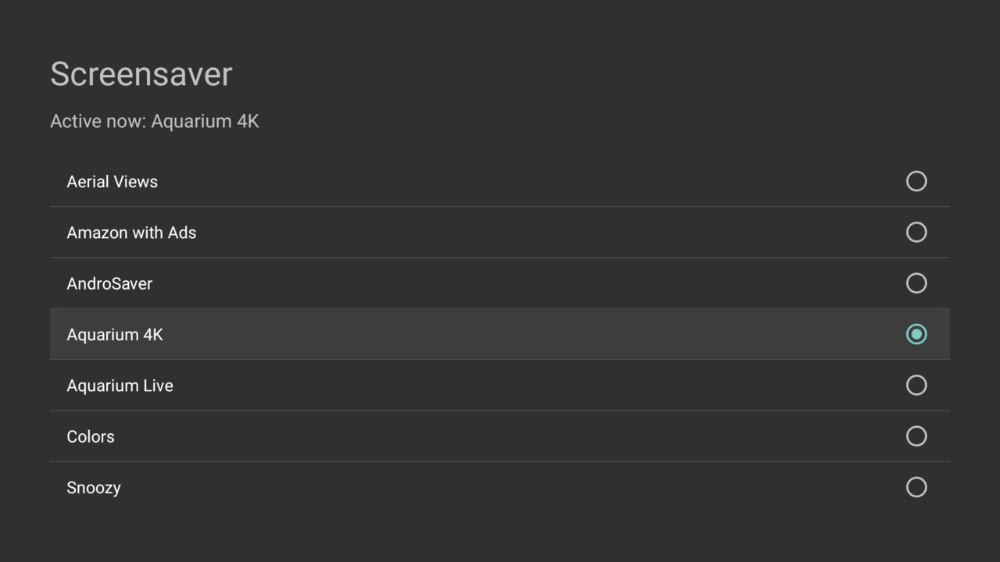</picture></a>
</p>

### Screensavers

<p align="center">
    <a href="docs/screenshots/screensaver-aerial-views.jpg"><picture><source media="(min-width: 1280px)" srcset="docs/screenshots/grid/screensaver-aerial-views-desktop.jpg 2x"><source media="(min-width: 600px)" srcset="docs/screenshots/grid/screensaver-aerial-views-tablet.jpg 2x">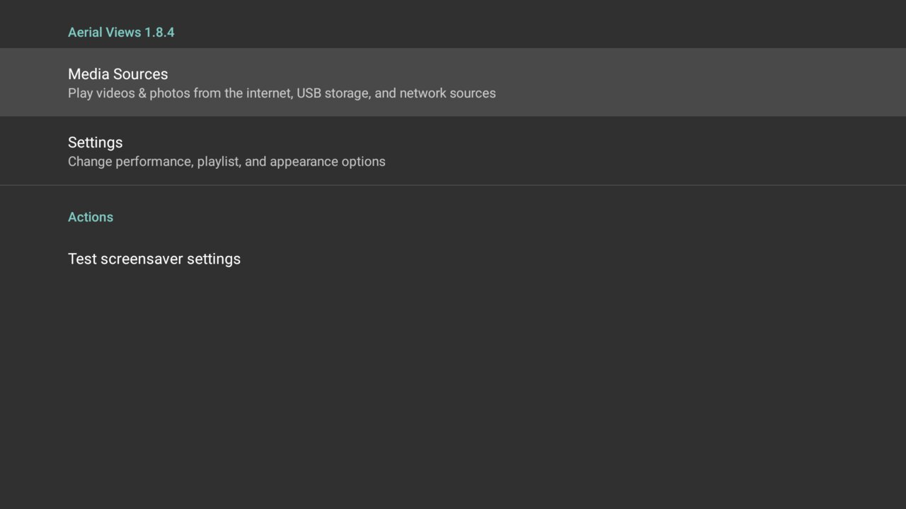</picture></a>
    <a href="docs/screenshots/screensaver-aquarium-4k.jpg"><picture><source media="(min-width: 1280px)" srcset="docs/screenshots/grid/screensaver-aquarium-4k-desktop.jpg 2x"><source media="(min-width: 600px)" srcset="docs/screenshots/grid/screensaver-aquarium-4k-tablet.jpg 2x">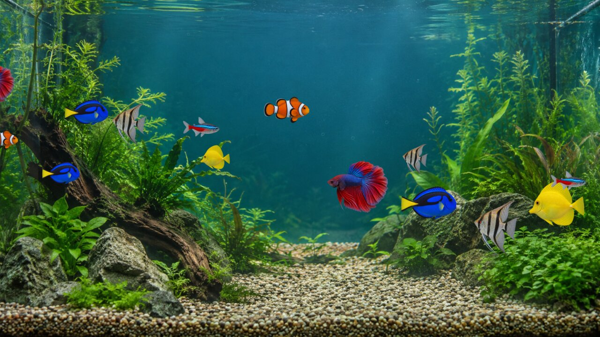</picture></a>
    <a href="docs/screenshots/screensaver-aquarium-live.jpg"><picture><source media="(min-width: 1280px)" srcset="docs/screenshots/grid/screensaver-aquarium-live-desktop.jpg 2x"><source media="(min-width: 600px)" srcset="docs/screenshots/grid/screensaver-aquarium-live-tablet.jpg 2x">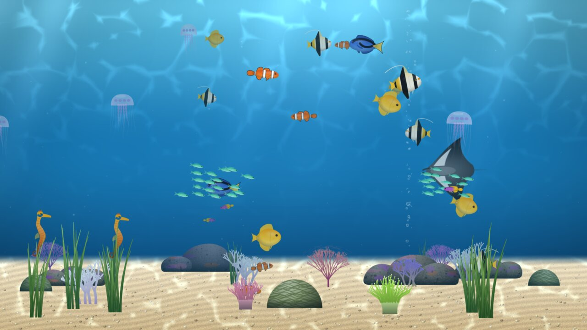</picture></a>
    <a href="docs/screenshots/screensaver-jellyfish-drift.jpg"><picture><source media="(min-width: 1280px)" srcset="docs/screenshots/grid/screensaver-jellyfish-drift-desktop.jpg 2x"><source media="(min-width: 600px)" srcset="docs/screenshots/grid/screensaver-jellyfish-drift-tablet.jpg 2x">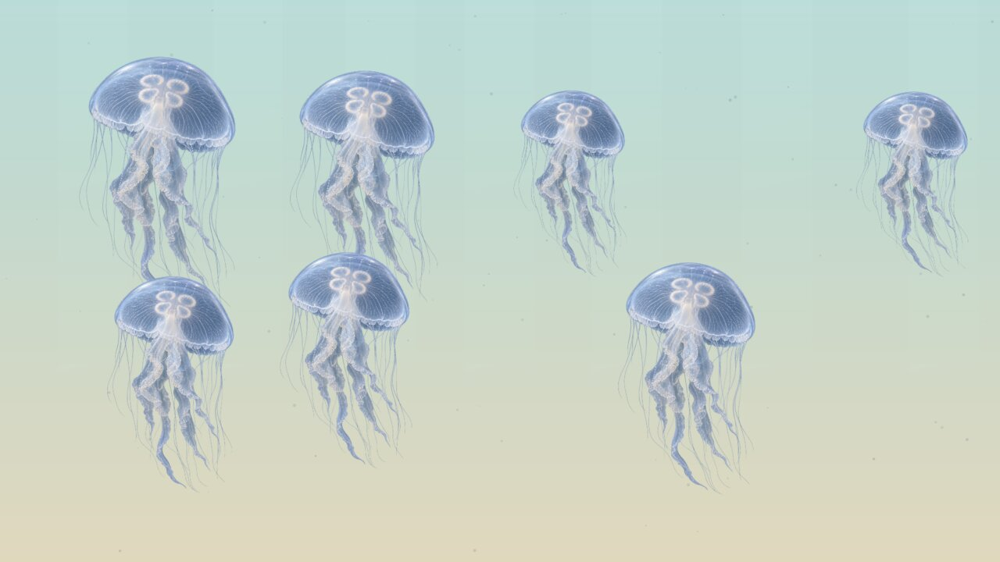</picture></a>
    <a href="docs/screenshots/screensaver-firefly-grove.jpg"><picture><source media="(min-width: 1280px)" srcset="docs/screenshots/grid/screensaver-firefly-grove-desktop.jpg 2x"><source media="(min-width: 600px)" srcset="docs/screenshots/grid/screensaver-firefly-grove-tablet.jpg 2x">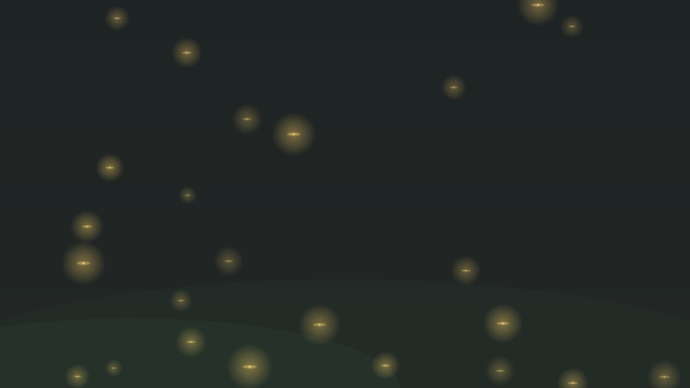</picture></a>
    <a href="docs/screenshots/screensaver-neon-corridor.jpg"><picture><source media="(min-width: 1280px)" srcset="docs/screenshots/grid/screensaver-neon-corridor-desktop.jpg 2x"><source media="(min-width: 600px)" srcset="docs/screenshots/grid/screensaver-neon-corridor-tablet.jpg 2x">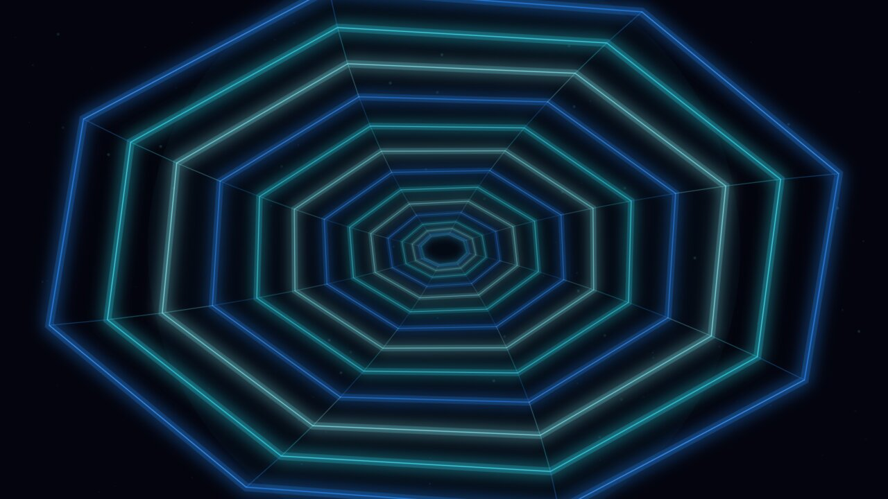</picture></a>
    <a href="docs/screenshots/screensaver-starfield-drift.jpg"><picture><source media="(min-width: 1280px)" srcset="docs/screenshots/grid/screensaver-starfield-drift-desktop.jpg 2x"><source media="(min-width: 600px)" srcset="docs/screenshots/grid/screensaver-starfield-drift-tablet.jpg 2x"></picture></a>
    <a href="docs/screenshots/screensaver-rain-on-glass.jpg"><picture><source media="(min-width: 1280px)" srcset="docs/screenshots/grid/screensaver-rain-on-glass-desktop.jpg 2x"><source media="(min-width: 600px)" srcset="docs/screenshots/grid/screensaver-rain-on-glass-tablet.jpg 2x">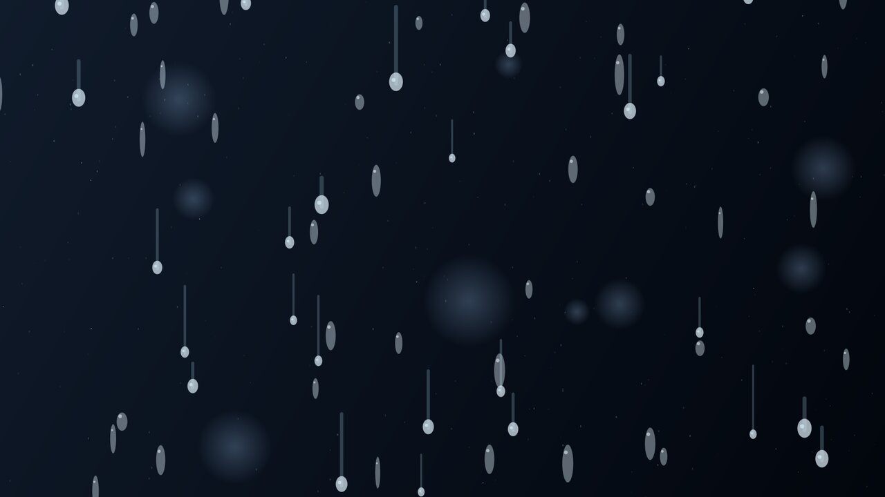</picture></a>
    <a href="docs/screenshots/screensaver-rainforest-cascade.jpg"><picture><source media="(min-width: 1280px)" srcset="docs/screenshots/grid/screensaver-rainforest-cascade-desktop.jpg 2x"><source media="(min-width: 600px)" srcset="docs/screenshots/grid/screensaver-rainforest-cascade-tablet.jpg 2x"></picture></a>
    <a href="docs/screenshots/screensaver-blue-meridian.jpg"><picture><source media="(min-width: 1280px)" srcset="docs/screenshots/grid/screensaver-blue-meridian-desktop.jpg 2x"><source media="(min-width: 600px)" srcset="docs/screenshots/grid/screensaver-blue-meridian-tablet.jpg 2x"></picture></a>
    <a href="docs/screenshots/screensaver-snoozy.jpg"><picture><source media="(min-width: 1280px)" srcset="docs/screenshots/grid/screensaver-snoozy-desktop.jpg 2x"><source media="(min-width: 600px)" srcset="docs/screenshots/grid/screensaver-snoozy-tablet.jpg 2x">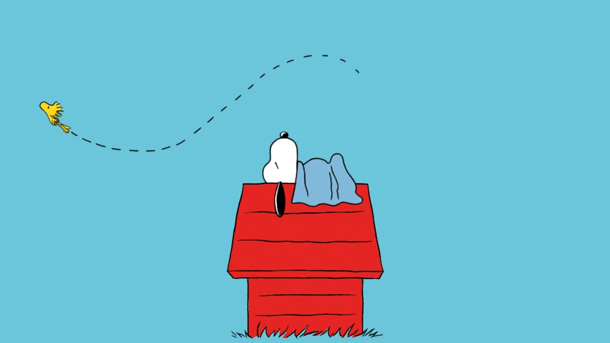</picture></a>
    <a href="docs/screenshots/screensaver-androsaver.jpg"><picture><source media="(min-width: 1280px)" srcset="docs/screenshots/grid/screensaver-androsaver-desktop.jpg 2x"><source media="(min-width: 600px)" srcset="docs/screenshots/grid/screensaver-androsaver-tablet.jpg 2x">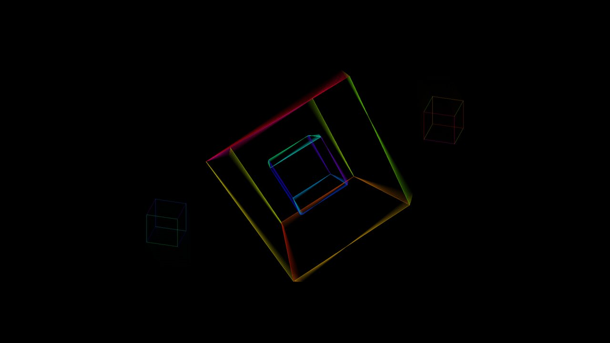</picture></a>
    <a href="docs/screenshots/screensaver-colors.jpg"><picture><source media="(min-width: 1280px)" srcset="docs/screenshots/grid/screensaver-colors-desktop.jpg 2x"><source media="(min-width: 600px)" srcset="docs/screenshots/grid/screensaver-colors-tablet.jpg 2x">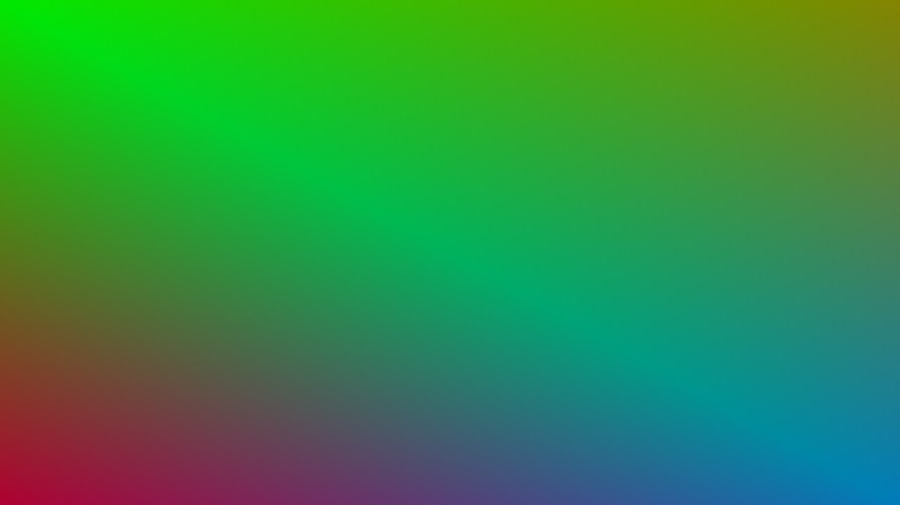</picture></a>
    <a href="docs/screenshots/screensaver-amazon-with-ads.jpg"><picture><source media="(min-width: 1280px)" srcset="docs/screenshots/grid/screensaver-amazon-with-ads-desktop.jpg 2x"><source media="(min-width: 600px)" srcset="docs/screenshots/grid/screensaver-amazon-with-ads-tablet.jpg 2x">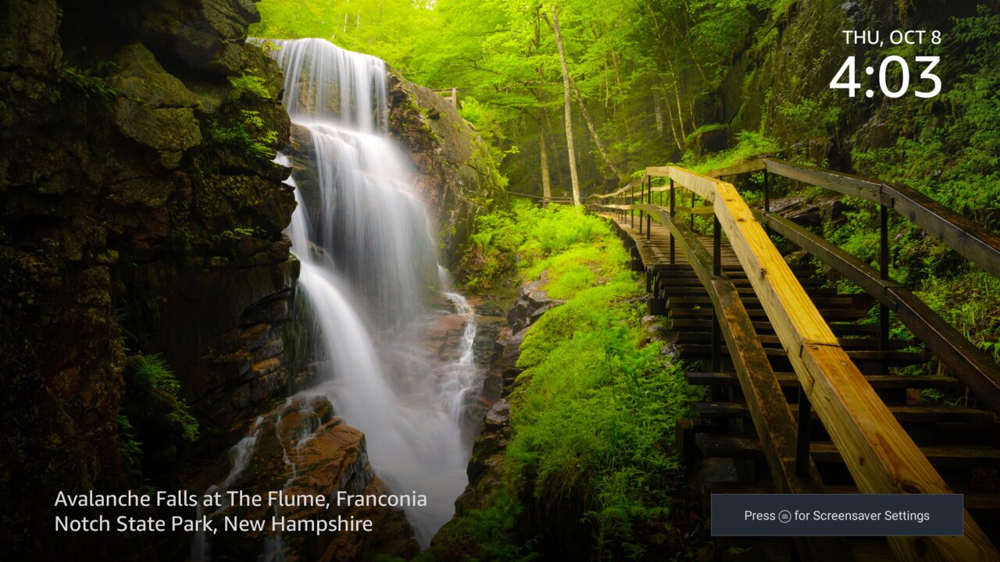</picture></a>
</p>

### The command line

<p align="center">
    <a href="docs/screenshots/cli-main-menu.jpg"><picture><source media="(min-width: 1280px)" srcset="docs/screenshots/grid/cli-main-menu-desktop.jpg 2x"><source media="(min-width: 600px)" srcset="docs/screenshots/grid/cli-main-menu-tablet.jpg 2x">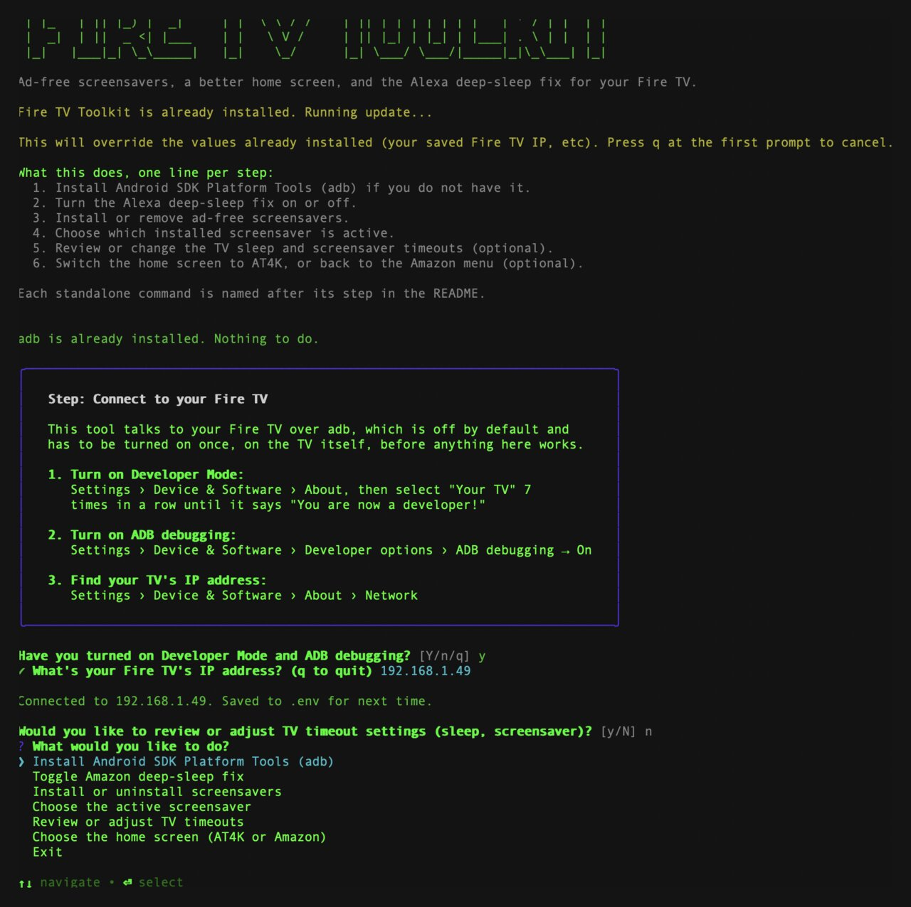</picture></a>
    <a href="docs/screenshots/cli-screensavers.jpg"><picture><source media="(min-width: 1280px)" srcset="docs/screenshots/grid/cli-screensavers-desktop.jpg 2x"><source media="(min-width: 600px)" srcset="docs/screenshots/grid/cli-screensavers-tablet.jpg 2x">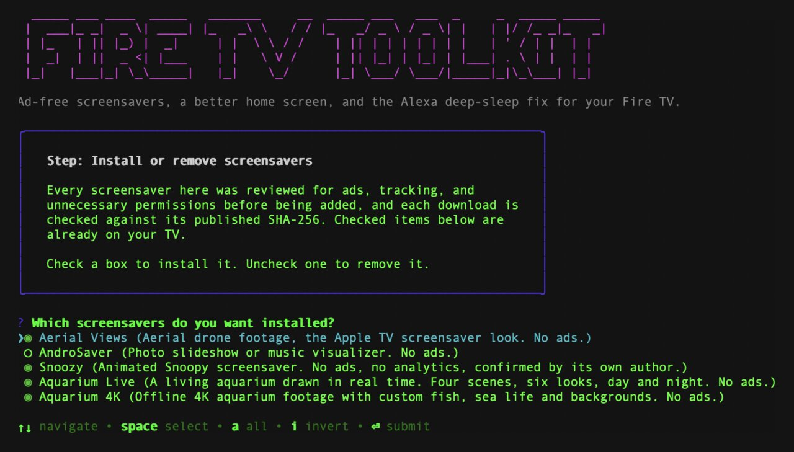</picture></a>
    <a href="docs/screenshots/cli-choose-screensaver.jpg"><picture><source media="(min-width: 1280px)" srcset="docs/screenshots/grid/cli-choose-screensaver-desktop.jpg 2x"><source media="(min-width: 600px)" srcset="docs/screenshots/grid/cli-choose-screensaver-tablet.jpg 2x">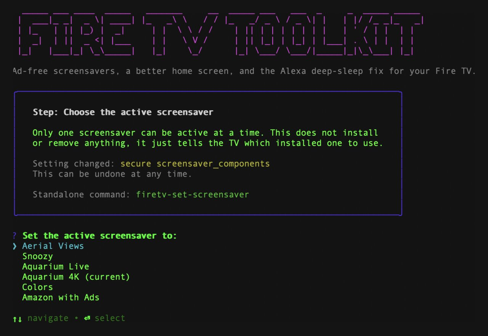</picture></a>
    <a href="docs/screenshots/cli-launcher.jpg"><picture><source media="(min-width: 1280px)" srcset="docs/screenshots/grid/cli-launcher-desktop.jpg 2x"><source media="(min-width: 600px)" srcset="docs/screenshots/grid/cli-launcher-tablet.jpg 2x">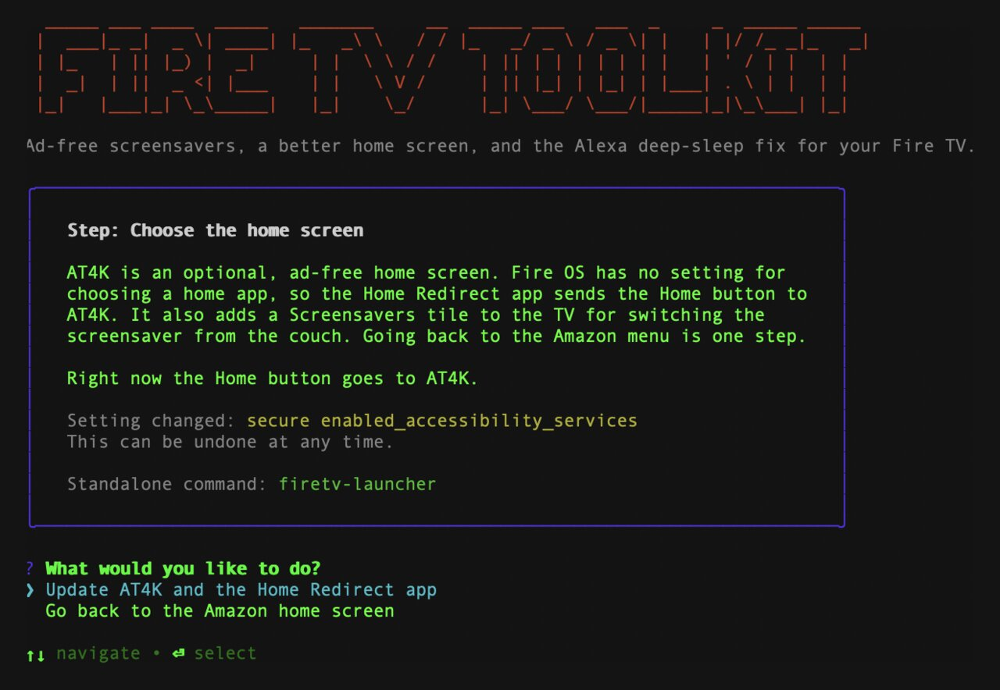</picture></a>
    <a href="docs/screenshots/cli-optimize.jpg"><picture><source media="(min-width: 1280px)" srcset="docs/screenshots/grid/cli-optimize-desktop.jpg 2x"><source media="(min-width: 600px)" srcset="docs/screenshots/grid/cli-optimize-tablet.jpg 2x">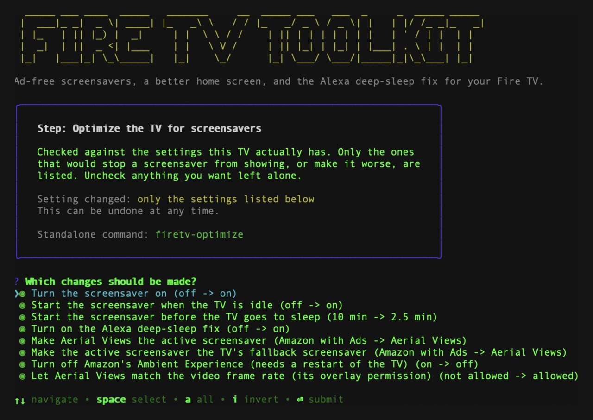</picture></a>
    <a href="docs/screenshots/cli-guard.jpg"><picture><source media="(min-width: 1280px)" srcset="docs/screenshots/grid/cli-guard-desktop.jpg 2x"><source media="(min-width: 600px)" srcset="docs/screenshots/grid/cli-guard-tablet.jpg 2x">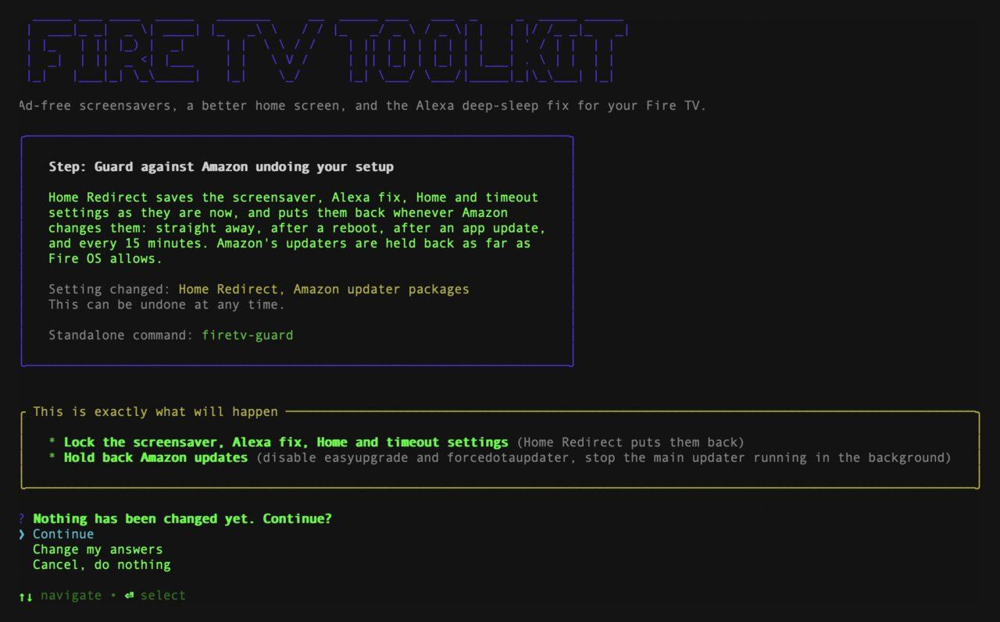</picture></a>
    <a href="docs/screenshots/cli-timeouts.jpg"><picture><source media="(min-width: 1280px)" srcset="docs/screenshots/grid/cli-timeouts-desktop.jpg 2x"><source media="(min-width: 600px)" srcset="docs/screenshots/grid/cli-timeouts-tablet.jpg 2x">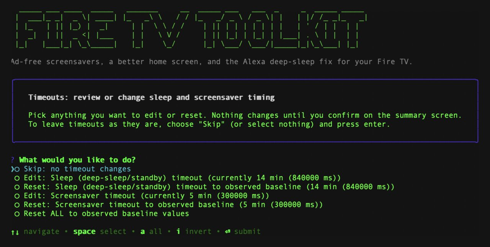</picture></a>
    <a href="docs/screenshots/cli-timeouts-current.jpg"><picture><source media="(min-width: 1280px)" srcset="docs/screenshots/grid/cli-timeouts-current-desktop.jpg 2x"><source media="(min-width: 600px)" srcset="docs/screenshots/grid/cli-timeouts-current-tablet.jpg 2x">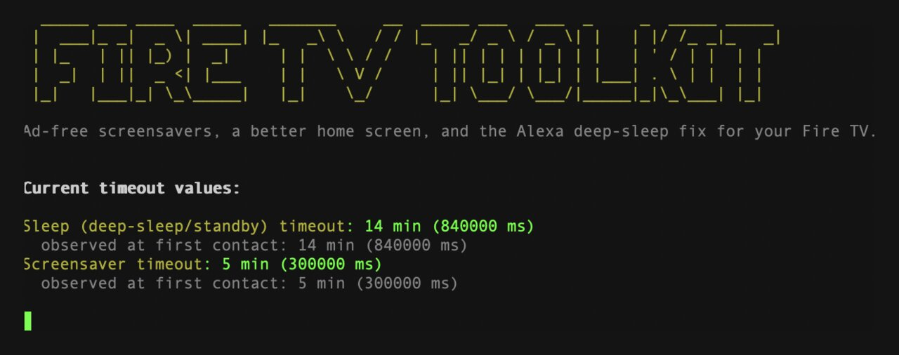</picture></a>
    <a href="docs/screenshots/cli-revert.jpg"><picture><source media="(min-width: 1280px)" srcset="docs/screenshots/grid/cli-revert-desktop.jpg 2x"><source media="(min-width: 600px)" srcset="docs/screenshots/grid/cli-revert-tablet.jpg 2x">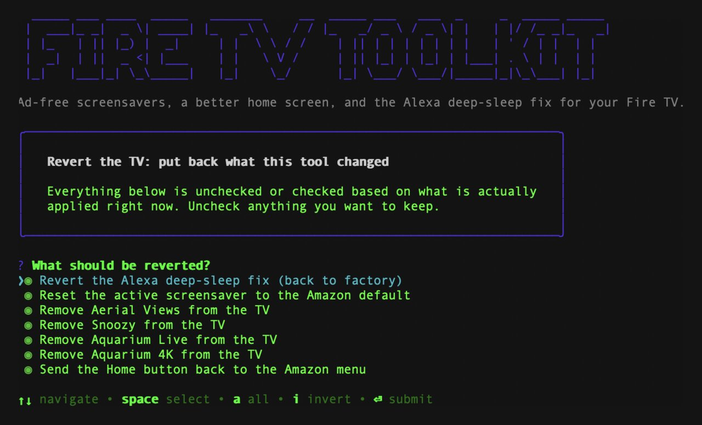</picture></a>
    <a href="docs/screenshots/cli-info.jpg"><picture><source media="(min-width: 1280px)" srcset="docs/screenshots/grid/cli-info-desktop.jpg 2x"><source media="(min-width: 600px)" srcset="docs/screenshots/grid/cli-info-tablet.jpg 2x">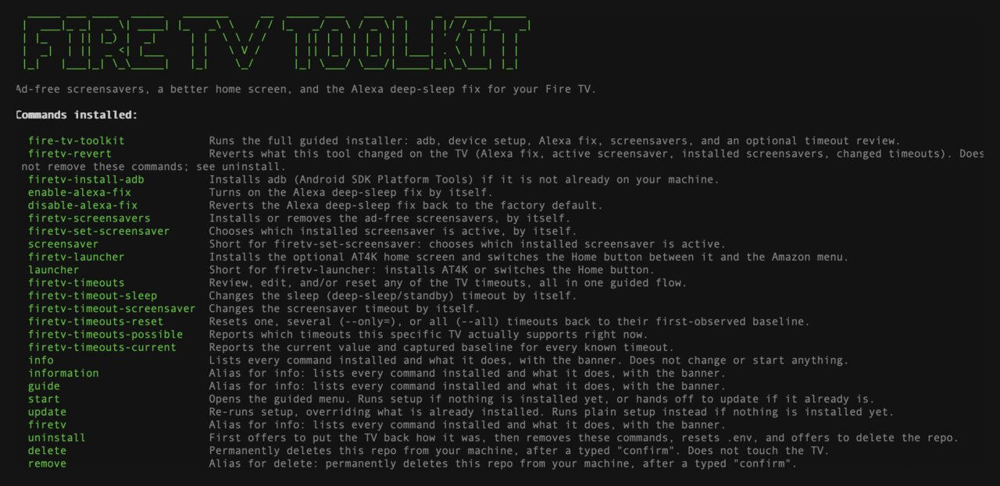</picture></a>
</p>

## Platform support

| Platform | Status |
|----------|--------|
| Fire TV Edition TVs (Fire OS 8, Android 11) | Tested on an Insignia Fire TV Edition, model AFTDEC012E, Fire OS 8.1.8.5 |
| Fire TV Stick and Cube | Not tested yet |
| macOS | Tested |
| Linux | Tests pass in CI; not tested against a TV |
| Windows | Not supported |
| Node.js | 18, 20, 22 and 26 tested |

## Requirements

- Node.js 18 or later
- A Fire TV on the same network as your computer, with ADB debugging turned on
- adb (Android SDK Platform Tools); the tool can install it for you
- To build the Home Redirect app yourself: a JDK and the Android SDK build tools (see [Development](docs/DEVELOPMENT.md))

### Required packages

| Package | Used for |
|---------|----------|
| [@inquirer/prompts](https://www.npmjs.com/package/@inquirer/prompts) | Menus, checklists and text prompts |
| [boxen](https://www.npmjs.com/package/boxen) | The boxed step explanations |
| [chalk](https://www.npmjs.com/package/chalk) | Terminal colors |
| [dotenv](https://www.npmjs.com/package/dotenv) | Reading the saved settings in `.env` |
| [figlet](https://www.npmjs.com/package/figlet) | The title banner |
| [ora](https://www.npmjs.com/package/ora) | Progress spinners |

## Integrations

- **adb**: every change on the TV is a plain adb command; [How it works](docs/HOW-IT-WORKS.md) lists them all.
- **GitHub Releases**: screensaver and Home Redirect APKs are downloaded from releases and checked against their published SHA-256.
- **AT4K launcher**: installed from its author's own release and checked against a hash pinned in this tool. See [Home screen](docs/LAUNCHER.md).
- **Fire OS settings**: the Alexa fix, the active screensaver, the timeouts and the accessibility services the home screen uses.

## Putting your Fire TV in developer mode

Before running the installer, turn on Developer Mode and ADB debugging on the
TV itself. The exact menu names vary a little by Fire TV model and software
version. On a Fire TV Edition set (screenshots below), the path is `Settings >
Device & Software`:

<p align="center">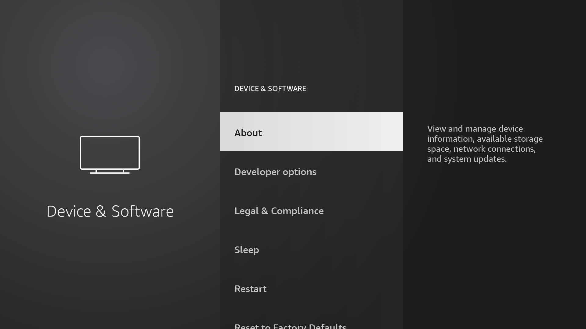</p>

1. **Turn on Developer Mode:** open `About`, then select "Your TV" 7 times in
   a row until it says "You are now a developer!"

<p align="center">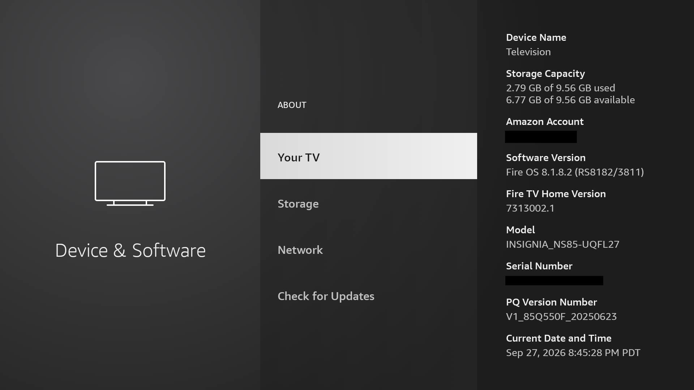</p>

2. **Turn on ADB debugging:** back out to `Device & Software`, open
   `Developer options`, and turn `ADB debugging` on.

<p align="center">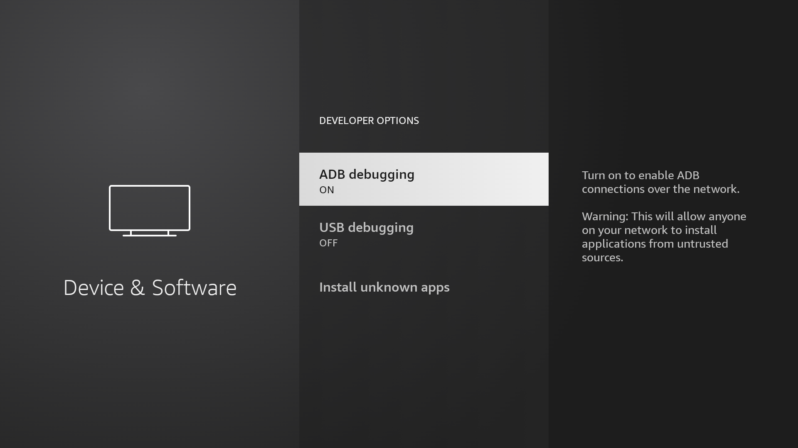</p>

3. **Find your TV's IP address:** back in `About`, open `Network`. Numbers
   below are blurred out, this is just to show where to look on your own TV.

<p align="center">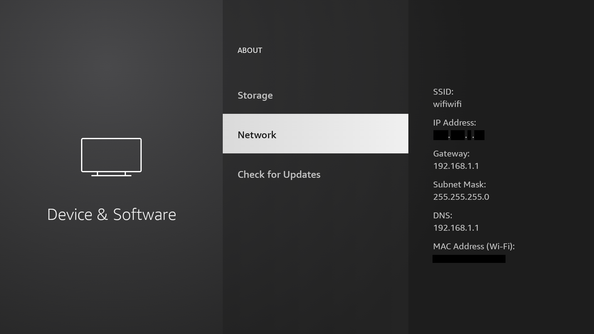</p>

The installer asks you to confirm this and prompts for the IP address before
doing anything else.

## Installation

1. Clone the repo and run the setup script:

   ```bash
   git clone https://github.com/jeremykenedy/fire-tv-toolkit.git
   cd fire-tv-toolkit
   node setup.js
   ```

2. Pick what to do on the checklist: install the dependencies and link every command onto your PATH, and launch the guided app. Nothing runs until you confirm.
3. In the guided app, confirm developer mode is on and enter your TV's IP address. It is saved to `.env` so you are not asked again.
4. Choose what to set up: the Alexa fix, screensavers, timeouts, and optionally the AT4K home screen.

Run `start` any time to open the guided menu again. To install by hand instead: `npm install`, `npm link`, then `start`.

## Commands

Every command explains what it is about to change before asking you to confirm,
accepts `--help`, and can be cancelled with Esc at any prompt. The flags for
each one are listed in [Commands](docs/COMMANDS.md).

| Command | What it does |
|---------|--------------|
| `start` | Opens the guided menu. Runs setup the first time, then hands off to `update`. |
| `update` | Re-runs setup, replacing the saved values. |
| `fire-tv-toolkit` | Runs the full guided installer. |
| `info`, `information`, `guide`, `firetv` | Lists every command and what it does. |
| `enable-alexa-fix` | Turns on the Alexa deep-sleep fix. |
| `disable-alexa-fix` | Turns the fix off again (factory behavior). |
| `firetv-screensavers` | Installs or removes the ad-free screensavers. |
| `screensaver`, `firetv-set-screensaver` | Chooses which installed screensaver is active. |
| `optimize`, `firetv-optimize` | Sets the TV up for screensavers, changing only settings it has. |
| `guard`, `firetv-guard` | Keeps Amazon from undoing your setup. `--check` puts back anything that changed, `--unlock=screensaver` frees the screensaver choice, `--off` turns it off. |
| `launcher`, `firetv-launcher` | Installs the AT4K home screen and switches the Home button between it and the Amazon menu. |
| `firetv-timeouts` | Reviews, edits or resets the sleep and screensaver timeouts in one flow. |
| `firetv-timeout-sleep` | Changes the sleep timeout. |
| `firetv-timeout-screensaver` | Changes the screensaver timeout. |
| `firetv-timeouts-reset` | Resets timeouts to the values first seen on your TV. |
| `firetv-timeouts-current` | Shows the current timeout values and their baselines. |
| `firetv-timeouts-possible` | Shows which timeouts this TV supports. |
| `firetv-install-adb` | Installs adb if it is missing. |
| `firetv-revert` | Puts the TV back how it was, item by item. Keeps the tool installed. |
| `uninstall` | Reverts the TV, then removes the commands and resets `.env`. |
| `delete`, `remove` | Deletes the repo from your computer after a typed `confirm`. |

## Upgrading

1. Pull the latest code: `git pull`.
2. Run `node setup.js` and choose to install and link the commands.
3. Run `start` to pick up anything new, such as the AT4K home screen.

Your saved IP and timeout baselines in `.env` are kept. Coming from version 2
(`amazon-fire-tv-fixes`), the commands were renamed: remove the old links with
`npm uninstall -g amazon-fire-tv-fixes` before step 2. See the
[Changelog](CHANGELOG.md) for what changed.

## Configuration

Everything is configured through the guided menus and flags; there is nothing
to edit by hand. The tool keeps a small `.env` file with your TV's IP address,
whether setup has finished, and the first timeout values seen on your TV.
Every key is described in [Configuration](docs/CONFIGURATION.md).

## File tree

```text
fire-tv-toolkit/
├── android/home-redirect/   # The Home Redirect app: sends Home to AT4K, adds the Screensavers tile
├── art/                     # README banners
├── bin/                     # One entry point per command
├── docs/                    # Guides, references and screenshots
├── src/
│   ├── apply/               # The adb changes themselves
│   ├── steps/               # Each command's prompts and flags
│   ├── adb.js               # Talking to the TV
│   ├── launcher-registry.js # AT4K and Home Redirect, with their sources and checksums
│   └── screensaver-registry.js # The vetted screensavers
├── test/                    # Tests, with a fake TV so no real device is needed
├── setup.js                 # First-run setup on a fresh clone
└── .env.example             # Template for the saved settings
```

## Documentation

Every guide is also on the project site: [jeremykenedy.github.io/fire-tv-toolkit](https://jeremykenedy.github.io/fire-tv-toolkit/).

| Guide | What it covers |
|-------|----------------|
| [Commands](docs/COMMANDS.md) | Every command and every flag |
| [Configuration](docs/CONFIGURATION.md) | The `.env` file and each saved value |
| [How it works](docs/HOW-IT-WORKS.md) | The exact adb settings each command changes |
| [Screensavers](docs/SCREENSAVERS.md) | Each screensaver, where it comes from, and how downloads are verified |
| [Home screen](docs/LAUNCHER.md) | The AT4K home screen, Home Redirect and the on-TV picker |
| [Guard](docs/GUARD.md) | What the guard keeps, how it fights Amazon's updates, and its limits |
| [Optimizing](docs/OPTIMIZE.md) | What `optimize` checks, what it changes, and how it is undone |
| [Timeouts](docs/TIMEOUTS.md) | The sleep and screensaver timeouts and their baselines |
| [Uninstalling](docs/UNINSTALLING.md) | Reverting the TV and removing the tool |
| [Troubleshooting](docs/TROUBLESHOOTING.md) | When the TV cannot be reached, or a setting changes back |
| [Development](docs/DEVELOPMENT.md) | Tests, coverage, building Home Redirect and releasing |

## Testing

```bash
npm test
npm run coverage
```

The tests run against a fake TV, so no device is needed. See [Development](docs/DEVELOPMENT.md).

## Changelog

See [CHANGELOG.md](CHANGELOG.md) and the [releases](https://github.com/jeremykenedy/fire-tv-toolkit/releases).

## Credits

The third-party screensavers are forks of these projects. All credit for the
original work belongs to their authors:

- [Aerial Views](https://github.com/theothernt/AerialViews) by theothernt
- [androsaver](https://github.com/Whichcraft/androsaver) by Whichcraft
- [Snoozy](https://github.com/avadhesh18/Snoozy) by avadhesh18
- [AT4K Launcher](https://github.com/avadhesh18/at4k) by avadhesh18, installed unmodified from its own release

## License

This package is open-sourced software licensed under the [MIT license](LICENSE).
